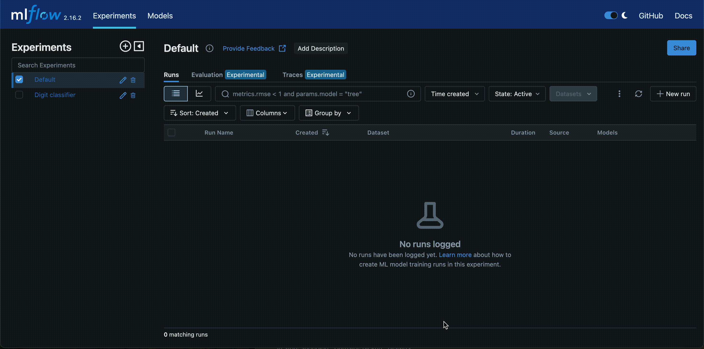
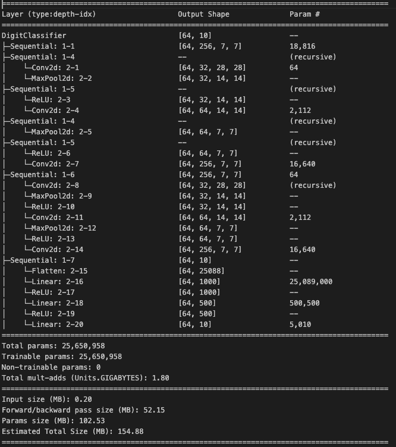

## Training Pipeline 

### 1. Build base image.  

```bash

docker build -t serve-project-base -f Dockerfile.base .

```
### 2. Build Training job image

```bash

docker build -t training-job -f Dockerfile.training .

```
### 3. Build services.

```bash

docker compose build

```

### 4. Run services.

```bash

docker compose up

```

### 5. Run training job.

```bash

docker run -v ./train_out:/app/out -v ./hyperparameter_tuning:/app/hyperparameter_tuning training-job

```

MLFlow will be running on `http://localhost:5050` 

Inference Server will be running on `http://localhost:8080`

### 6. Alias registered model as dev

Go to ML Flow (linked above), find run, find model, alias as dev.




### 7. Prepare model for serving

#### Note full model uri.

```bash

curl -XPOST http://localhost:8080/internal/prep_model -d '{"model_uri": "models:/digit-classifier@dev"}' -H Content-Type: 'application/json'

```


## Model Summary

