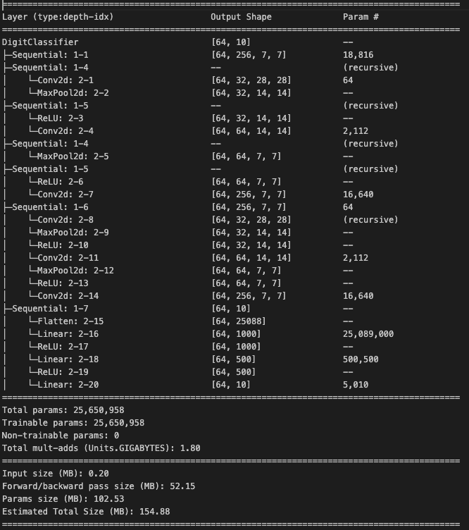

## ML Training and Serving Infra 

###  Model Summary


### Project Structure

The project is broken down into three components:
1. MLFlow: Responsible for experiment management
2. Training Job: Responsible for providing a hyperparameter tuning job
3. Inference Server: Responsible for hosting a registered model

Each component is provided as a container.

### 0. Setup project

```bash
git clone git@github.com:anushrii/Digit-Classifier.git
cd Digit-Classifier
```

### 1. Build base image

```bash

docker build -t serve-project-base -f Dockerfile.base .

```
### 2. Build Training job image

```bash

docker build -t training-job -f Dockerfile.training .

```
### 3. Build services

```bash

docker compose build

```

### 4. Run services

Run in a new terminal or new tab:
```bash

docker compose up

```

MLFlow will be running on `http://localhost:5050` 

Inference Server will be running on `http://localhost:8080`


### 5. Run a hyperparameter tuning job

The hyperparameter tuning job config can be found at `hyperparameter_tuning/config.yaml` . Update the given parameters as needed. Adding new parameters is not supported in the current implementation.

Sample:

```yaml
experiment_name: Digit Classification
batch_sizes:
  - 32
  - 64
learning_rates: 
  - 0.01
  - 0.001
epoch_choices: 
  - 1
  - 2
num_runs: 3

```

Run in a new terminal or new tab:

```bash

docker run -v ./hyperparameter_tuning:/app/hyperparameter_tuning training-job

```

### 6. Alias registered model as dev

Go to ML Flow (linked above), find run, find model, alias as dev.


### 7. Prepare model for serving

#### Note full model uri.

Run in a new terminal or new tab:
```bash

curl -XPOST http://localhost:8080/internal/prep_model/digit-classifier/dev -H Content-Type: 'application/json'

```

### 8. Run a simple inference invocation

```bash
python test_script.py
```

### 9. Clean up

```bash
docker compose down
```
